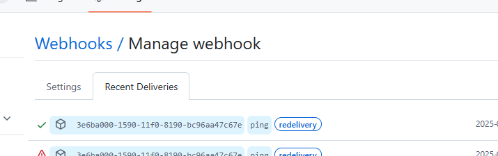

## Integrating Jenkins
To integrate Jenkins into the application we relied on the steps provided in Lab 9.
We had to tweak the docker-compose.yaml file as because in deliverable 1, we used dockerfile to build the project, docker-compsoe was running building the java project instead of Jenkins.

So instead, docker-compose was updated to use the lastest image of jenkins instead. 
docker-compose wwas also tweaked to build the java project as well

use github webhook: https://medium.com/@sangeetv09/how-to-configure-webhook-in-github-and-jenkins-for-automatic-trigger-with-cicd-pipeline-34133e9de0ea

test webhook after making the forward access public

FOllwing this video and his tutorial:
https://www.youtube.com/watch?v=swrgvbwpWQ4
https://appychip.co/jenkins-automated-build-trigger-using-github-pull-request-builder/

